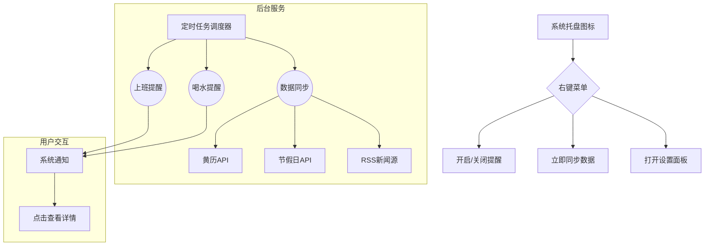

### **「桌面助手小工具」设计文档**

---

#### **1. 项目概述**
- **目标**：开发一款轻量级桌面常驻工具，集成时间管理、健康提醒、生活信息服务功能。
- **核心场景**：
  - 用户上班/下班时自动弹出系统通知。
  - 周期性提醒喝水/休息（如每2小时一次）。
  - 展示当日黄历信息（宜/忌）。
  - 自动同步国家法定节假日并提醒调休安排。
  - 每日定时推送简要新闻摘要。
- **用户界面**：
  - 系统托盘图标常驻右下角，右键菜单控制功能。
  - 通过弹窗通知（非侵入式）传递提醒信息。
  - 点击通知可查看详细信息（如完整新闻或黄历）。

---

#### **2. 功能模块分解**
##### **2.1 核心提醒模块**
| 功能              | 触发条件                          | 行为                                 |
|-------------------|----------------------------------|--------------------------------------|
| 上下班提醒         | 每日预设时间（如9:00/18:00）      | 弹窗通知（"该打卡啦！"）               |
| 喝水/休息提醒      | 自定义间隔（如每2小时）            | 随机提示语（"该喝水了！" / "起来走走~"）|
| 节假日提醒         | 同步国家法定节假日数据             | 提前1天提醒调休/假期开始               |

##### **2.2 数据服务模块**
| 功能              | 数据来源                          | 更新频率         | 缓存策略        |
|-------------------|----------------------------------|------------------|-----------------|
| 黄历信息           | 第三方API（例如：聚合数据平台）    | 每日8:00更新      | 本地存储当天数据 |
| 法定节假日         | 政府公开数据/开源API              | 每月1日检查更新   | 存储全年数据     |
| 每日新闻           | RSS订阅源（如新浪头条）            | 每小时抓取新内容  | 保留最新10条     |

##### **2.3 用户配置模块**
```json
// 示例配置文件(config.json)
{
  "work_time": {"start": "09:00", "end": "18:00"},
  "reminder": {
    "drink_interval": 120,  // 分钟
    "enable_news": true,
    "notification_style": "toast"  // toast/bubble
  },
  "api_keys": {
    "huangli": "API_KEY_XXXX" 
  }
}
```

---

#### **3. 系统架构**


---

#### **4. 关键技术实现方案**
##### **4.1 多线程任务管理**
- **主线程**：处理GUI事件循环（PyQt5）
- **子线程**：
  - 定时任务线程（APScheduler）
  - 网络请求线程（避免界面卡顿）
  - 使用`QThread`实现Qt安全线程通信

##### **4.2 节假日数据同步**
1. 优先使用本地缓存数据
2. 通过公开API获取最新数据（例如：https://timor.tech/api/holiday ）
3. 数据格式转换：
```python
# API返回示例
{
  "code": 0,
  "holiday": {
    "2023-10-01": {"name": "国庆节", "isOffDay": true}
  }
}
```

##### **4.3 弹窗通知优化**
- **多平台兼容**：Windows用`win10toast`，macOS用`pyobjc`
- **交互设计**：
  - 默认显示5秒后自动消失
  - 点击通知跳转详细页面
  - 支持静默模式（仅托盘图标闪烁）

---

#### **5. 开发路线图**
1. **Phase 1 - 核心框架**（3天）
   - 实现托盘图标与基础菜单
   - 完成定时提醒基础逻辑
   - 本地配置文件读写

2. **Phase 2 - 数据服务**（5天）
   - 集成黄历API
   - 节假日数据同步
   - 新闻抓取与过滤

3. **Phase 3 - 用户体验优化**（2天）
   - 通知样式定制
   - 异常处理（如断网状态降级）
   - 生成可执行文件（PyInstaller）

---

#### **6. 风险与应对**
| 风险点                  | 应对方案                                  |
|-------------------------|------------------------------------------|
| 第三方API不稳定          | 本地缓存+备用数据源（如静态黄历数据）       |
| 不同操作系统通知差异     | 使用`plyer`库跨平台抽象层                  |
| 长时间运行内存泄漏       | 用`tracemalloc`定期监控内存占用            |

---

#### **7. 扩展性设计**
- **插件机制预留**：通过`importlib`动态加载扩展模块
- **未来可扩展功能**：
  - 天气预报（根据IP自动定位）
  - 备忘录便签功能
  - 番茄钟专注计时器

---

**是否需要深入某个模块的具体实现逻辑？或者需要补充其他设计细节？**
